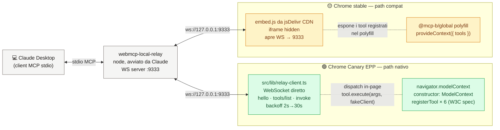

# Bella Roma Coffee — Demo WebMCP

> **Proof-of-Concept**: una vetrina e‑commerce *agent-ready*. Un agente AI (Claude Desktop) ordina caffè, applica coupon e fa checkout su una pagina React **senza** vedere il DOM, senza scraper, senza pilotare il cursore — chiama direttamente i tool che la pagina espone.

🌐 **Demo live**: <https://bella-roma-web-mcp.vercel.app/> — apri il link, attiva il toggle `Relay · Off → CDN` in header e collega Claude Desktop (vedi Step 2 più sotto). Niente da installare lato sito.

Single-page React app che simula la torrefazione fittizia **Bella Roma Coffee** ed espone le sue azioni come **10 tool WebMCP** invocabili da un agente AI nel browser tramite `navigator.modelContext`. Pensata per una demo da 60 secondi davanti a stakeholder non tecnici, ma costruita su standard reali (W3C Draft Community Group Report, febbraio 2026).

Il catalogo include 27 prodotti (13 drink, 4 food, 3 chicchi take-home, 2 capsule, 5 opzioni latte di cui una "esaurita" per dimostrare la sostituzione). Ogni prodotto è annotato con intensità, origine, note aromatiche, dietary, tag, pairing, prodotti correlati e opzioni di personalizzazione (size / latte / zucchero). Il set di tool resta volutamente minimale: l'agente compone primitive piccole invece di chiamare endpoint di alto livello.

## Scopo

1. **Mostrare WebMCP all'opera** su un caso d'uso commerciale credibile (catalogo prodotti, carrello, coupon, checkout), non su uno snippet astratto.
2. **Confrontare i due percorsi di adozione**: il browser nativo (Chrome Canary EPP, `navigator.modelContext`) e il polyfill della community (`@mcp-b/global`) — *stesso codice di tool*, due bridge diversi, indicatori live in header per capirlo a colpo d'occhio.
3. **Provare l'ergonomia "user-in-the-loop"**: il `checkout` chiama `agent.requestUserInteraction(...)` e fa apparire un modale di conferma. L'AI **non agisce di nascosto** — la UI manuale e quella agentica condividono lo stesso store.
4. **Materiale di onboarding interno**: lo stack è volutamente minimo (Vite + React + Zustand) per essere leggibile in un'ora; tutta la logica WebMCP vive in ~5 file in `src/lib/`.

## Cos'è WebMCP

[WebMCP](https://github.com/webmachinelearning/webmcp) è una proposta di standard W3C (Web Machine Learning CG, editori Google + Microsoft) che permette a qualsiasi sito di **registrare tool** invocabili da agenti AI nel browser, senza scrivere uno scraper o pilotare la UI tramite DOM/screenshot. Disponibile in early preview in **Chrome 146 Canary** dietro flag. Per il contesto completo (storia, API, casi d'uso, confronto con MCP "classico") vedi [`RESEARCH.md`](RESEARCH.md).

## Quick start

**In locale:**

```bash
npm install
npm run dev
```

Apri http://localhost:5173

**Senza installare nulla:** apri direttamente la versione deployata su <https://bella-roma-web-mcp.vercel.app/> — funziona con Chrome stabile via polyfill `@mcp-b/global` da CDN.

## Guida al test passo-passo

Questa è la guida operativa: cosa fare, in che ordine, cosa aspettarsi a video. Pensata per **non tecnici** — chiunque sappia copia-incollare un comando ce la fa in ~10 minuti.

### Cosa ti serve prima di iniziare

- **Node.js 20+** installato → https://nodejs.org
- **Claude Desktop** installato → https://claude.ai/download
- **Un browser** aggiornato. Idealmente **Chrome stabile** (funziona col polyfill). Se hai **Chrome Canary 146+** vedrai anche il path nativo `navigator.modelContext`.

### Step 1 — Avvia il sito demo

In un terminale, dalla cartella del progetto:

```bash
npm install   # solo la prima volta
npm run dev
```

Apri **http://localhost:5173** nel browser. Vedrai la home di Bella Roma Coffee con catalogo, carrello a destra e — in alto a destra nella utility strip dell'header — due **pill di stato** (`WebMCP · …` e `Relay · Off`).

### Step 2 — Installa il relay MCP in Claude Desktop

Il "relay" è il ponte che fa parlare Claude Desktop con la pagina nel browser. **Si configura una sola volta.**

Apri (o crea) il file di configurazione di Claude Desktop:

- **macOS**: `~/Library/Application Support/Claude/claude_desktop_config.json`
- **Windows**: `%APPDATA%\Claude\claude_desktop_config.json`
- **Linux**: `~/.config/Claude/claude_desktop_config.json`

Inserisci questo contenuto (o aggiungi la voce `webmcp-local-relay` sotto `mcpServers` se ne hai già altre):

```json
{
  "mcpServers": {
    "webmcp-local-relay": {
      "command": "npx",
      "args": ["-y", "@mcp-b/webmcp-local-relay@latest"]
    }
  }
}
```

**Chiudi completamente Claude Desktop e riaprilo** (su macOS: ⌘Q — non basta chiudere la finestra). Al riavvio Claude scarica ed esegue il relay da solo.

Controllo rapido che il relay sia attivo (opzionale, da terminale):

```bash
lsof -nP -i :9333
# devi vedere una riga: node ... TCP 127.0.0.1:9333 (LISTEN)
```

Se non vedi nulla → vai a **Troubleshooting** in fondo.

### Step 3 — Attiva il bridge nella pagina

Torna su **http://localhost:5173** e clicca la pill **`Relay · Off`** in alto a destra. La pagina si ricarica con `?relay=true` nell'URL. La pill diventa:

- **`Relay · Live`** (verde) → sei su Chrome Canary con WebMCP nativo
- **`Relay · CDN`** (verde) → sei su Chrome stabile, parte il polyfill

Se vedi giallo/ambra (`connecting`, `closed`, `No API`) → **Troubleshooting**.

### Step 4 — Verifica che Claude veda i tool

Apri **Claude Desktop** e scrivi:

> *Mostrami le sorgenti WebMCP collegate.*

Claude deve elencare la tab **"Bella Roma Coffee"** con i suoi **10 tool** (`search_products`, `get_product`, `show_product_image`, `add_to_cart`, `remove_from_cart`, `apply_coupon`, `remove_coupon`, `clear_cart`, `get_cart`, `checkout`).

Se Claude dice "nessuna sorgente collegata", ricontrolla Step 2 e Step 3.

### Step 5 — Fai un giro di prova

Sei scenari pronti. Copia-incolla in Claude Desktop, **guarda la pagina mentre Claude lavora**: il carrello cambia in diretta e il **Tool Activity Log** in basso a destra registra ogni chiamata.

1. **Filtro da linguaggio naturale**
   > *Qualcosa di leggero e fruttato, senza latte, sotto i 4 euro. Aggiungilo al carrello.*

   Claude filtra il catalogo e mette un prodotto coerente in carrello. **Cosa guardare**: `search_products` → `add_to_cart` nel log; una nuova riga nel carrello.

2. **Sostituzione live su esaurito**
   > *Vorrei un cappuccino con latte di soia.*

   La soia è marcata "esaurita". L'agente riceve un errore strutturato con `alternatives[]` e propone avena o mandorla **prima** di aggiungere. **Cosa guardare**: l'AI non sbatte la testa contro il muro — recupera da sola.

3. **Bundle multi-item con vincoli**
   > *Componi un ordine colazione per 3 persone, max 15 euro, uno deve essere decaffeinato.*

   Più chiamate `add_to_cart`. **Cosa guardare**: 3 righe nel carrello che rispettano il budget e includono almeno un decaf.

4. **Customizzazione fine**
   > *Cappuccino grande con latte d'avena, senza zucchero.*

   Una sola `add_to_cart` con `options` complete. **Cosa guardare**: sotto il nome nel carrello compare "Grande · Avena · Senza zucchero".

5. **Coupon + checkout con conferma utente** *(il momento clou)*
   > *Applica il coupon BENVENUTO e completa l'ordine.*

   `apply_coupon` applica lo sconto, poi `checkout` chiama `agent.requestUserInteraction` e apre **un modale di conferma a video**. **Cosa guardare**: l'AI **non** conferma da sola — clicchi tu. È il punto chiave di WebMCP: l'azione irreversibile resta sotto controllo umano.

6. **Reset conversazionale**
   > *Annulla tutto, ricomincio da capo.*

   L'agente chiama `clear_cart` (svuota carrello + rimuove coupon in un colpo solo). **Cosa guardare**: il carrello si azzera dal log, niente loop di `remove_from_cart` per ogni riga.

Per ricominciare da zero anche fuori da Claude: clicca **`Reset demo`** in header. Svuota carrello, coupon e log.

> Suggerimento: nel banner **"I più chiesti"** in alto alla pagina trovi i prompt principali pronti al click — un click li copia negli appunti, poi incolli in Claude Desktop.

### Cosa osservare durante il test

Tre segnali ti dicono che tutto funziona:

- **Le due pill in header** sono verdi (`WebMCP · Native`/`Polyfill` + `Relay · Live`/`CDN`).
- **Il Tool Activity Log** in basso a destra registra in tempo reale ogni invocazione (nome tool, args, risultato, timestamp).
- **Il carrello** riflette esattamente le azioni di Claude — perché agente e utente leggono/scrivono dallo **stesso store**. Niente DOM scraping, niente screenshot.

---

## Riferimento tecnico: i due bridge

Due strade, **entrambe affidabili**, entrambe selezionabili dallo **stesso toggle pill in header** (`Relay · Off ⇄ Relay · Live/CDN`) o dal query param `?relay=true`. La pagina rileva il browser e instrada da sola al bridge giusto.

| Browser | Bridge selezionato | Estensione? | Polyfill? |
|---|---|---|---|
| Chrome Canary 146+ (EPP) | `relay-client.ts` in-page (nostro) | no | no — usa `navigator.modelContext` nativo |
| Chrome stable / qualunque | embed `@mcp-b/webmcp-local-relay` da CDN | no | sì (`@mcp-b/global`) |
| Toggle off | (nessuno) | — | — |

In tutti i casi il consumer è **Claude Desktop** (o qualunque client MCP stdio) tramite lo stesso relay locale `webmcp-local-relay` su `127.0.0.1:9333`.

### Tabella completa degli indicatori in header

La utility strip (la striscia navy sotto la promo bar) mostra **due pill** affiancate. Sono pill testuali con un puntino colorato.

| Pill | Stato | Significato |
|---|---|---|
| **WebMCP · Native** | 🟢 verde, pulsante | `navigator.modelContext` nativo (Chrome Canary, `ModelContext`) |
| **WebMCP · Polyfill** | 🟡 ambra | Polyfill `@mcp-b/global` caricato (Chrome stable) |
| **WebMCP · Offline** | ⚪ idle | Nessuna API WebMCP — né nativa né polyfill |
| **Relay · Off** | ⚪ idle | Toggle disattivato — la pagina non parla con Claude Desktop |
| **Relay · Live** | 🟢 verde | Path nativo, WebSocket verso `127.0.0.1:9333` `open` |
| **Relay · connecting / closed / error** | 🟡 ambra | Path nativo, WebSocket non ancora `open` (in apertura, chiuso, o errore) |
| **Relay · CDN** | 🟢 verde | Path compat, embed `@mcp-b/webmcp-local-relay` caricato da jsDelivr |
| **Relay · No API** | 🟡 ambra | Relay richiesto ma nessuna API WebMCP disponibile |

La pill **Relay** è anche un **toggle**: cliccarla aggiunge/rimuove `?relay=true` e ricarica la pagina. Accanto, il bottone **Reset demo** svuota carrello, coupon e Tool Activity Log.

Combo attese durante la demo:
- **Chrome Canary EPP**: `WebMCP · Native` + `Relay · Live`.
- **Chrome stable**: `WebMCP · Polyfill` + `Relay · CDN`.

### Come funzionano i due bridge



Tutto il routing tra i due bridge è in `src/lib/relay.ts` → `connectRelay(mode)`. La detection del mode (`native` vs `polyfill` vs `unavailable`) è in `src/lib/polyfill.ts`: distingue native vs polyfill confrontando `constructor.name === "ModelContext"` e l'assenza di `provideContext`, perché il solo `'modelContext' in navigator` non basta — alcuni setup caricano il polyfill come side-effect anche su browser nativi.

## Tool esposti

10 tool totali. Filosofia di design: **primitive piccole, agente compositore.** I tool "core" (`search_products`, `get_product`, `add_to_cart`) sono ricchi; ogni scenario complesso (bundle, pairing, upsell, sostituzione) viene composto dall'agente combinandoli, senza endpoint di alto livello.

| Tool | Cosa fa | Conferma utente |
|---|---|---|
| `search_products` | Filtra catalogo: categoria, tipo (drink/food/beans/capsule/milk_option), prezzo max, tag, dietary, note aromatiche, origine, intensità min/max, momento della giornata, in-stock-only, testo libero | no |
| `get_product` | Scheda completa di un prodotto: attributi, disponibilità, alternative se esaurito, pairing, prodotti correlati cross-modal, opzioni di personalizzazione | no |
| `show_product_image` | Ritorna un `resource_link` MCP con la foto editoriale del prodotto (URI su `cdn.jsdelivr.net`, whitelist della CSP `img-src` di Claude Desktop). Il client la rende inline nella card prodotto | no |
| `add_to_cart` | Aggiunge un prodotto al carrello con `options` (size, milk, sweetness). Ritorna errore strutturato con `alternatives[]` se il prodotto o l'opzione latte richiesta è ESAURITA | no |
| `remove_from_cart` | Rimuove riga (passa `options` per disambiguare righe stesso prodotto con varianti diverse) | no |
| `apply_coupon` | Applica `BENVENUTO` (-10%) o `STUDENTI` (-20% max €5). Sovrascrive un coupon già attivo | no |
| `remove_coupon` | Rimuove il coupon corrente lasciando il carrello intatto | no |
| `clear_cart` | Svuota carrello + rimuove coupon in un'unica chiamata (reset conversazionale) | no |
| `get_cart` | Ritorna stato carrello (incluse opzioni per riga e prezzi con modifier) | no |
| `checkout` | Conferma ordine | **sì** (modale `requestUserInteraction`) |

Le immagini di prodotto vengono servite dal repo pubblico [`Sgr57/bella-roma-assets`](https://github.com/Sgr57/bella-roma-assets) via `cdn.jsdelivr.net`: il dominio Vercel principale non è nella CSP `img-src` degli iframe MCP App di Claude Desktop, jsdelivr sì.

### Schema prodotto

Ogni `Product` ha campi opzionali ricchi: `intensity` (1-10), `origin`, `flavor_notes[]`, `dietary[]`, `temperature`, `tags[]`, `time_of_day[]`, `pairings[]` (id di prodotti consigliati in pairing), `related_products[]` (varianti cross-modal: drink → chicchi/capsule equivalenti), `available`, `alternatives[]` (id di sostituti coerenti se esaurito), `options` (size con price modifier, milk che referenzia `milk_option` items, sweetness). Dettagli in [`src/lib/products.ts`](src/lib/products.ts).

## Test unitari (sviluppo)

```bash
npm test            # esegue Vitest una volta
npm run test:watch  # watch mode
```

Test su `store/cart`, `lib/products`, `lib/webmcp` (catalogo, store, tool adapter). Niente test E2E: la verifica visuale + il dry-run con un agente vero (vedi **Guida al test passo-passo** sopra) sono sufficienti per una demo.

## Architettura

- **Zustand** (`src/store/cart.ts`) è la *single source of truth* per carrello, coupon applicato e log delle invocazioni dei tool. Le righe del carrello supportano `options` (size, milk, sweetness): righe con options identiche si fondono; righe con options diverse restano distinte. `lineUnitPrice(item)` calcola il prezzo includendo il `size.price_modifier` e il `price` del milk option scelto come modificatore.
- **`src/lib/products.ts`** ospita lo schema `Product` esteso e il catalogo a 27 entry (5 tipi: drink, food, beans, capsule, milk_option). Helper `getProductById` e `getProductsByType`.
- **`src/lib/prompts.ts`** è la lista condivisa dei 7 prompt suggeriti (`TOP_PROMPTS`) e dei 3 selezionati per l'empty state del carrello (`CART_EMPTY_PROMPT_IDS`).
- **`src/lib/webmcp.ts`** è l'**adapter** tra l'API WebMCP e lo store. Espone `buildTools()` (10 tool) e `registerTools()` che è **dual-API**: usa `navigator.modelContext.registerTool(t)` (W3C spec, nativo) oppure `provideContext({tools})` (polyfill `@mcp-b/global`) a seconda di chi è presente. Idempotente (guard `registered` + dedup via `getTools()` quando disponibile).
- **`src/lib/polyfill.ts`** rileva la modalità (`native` / `polyfill` / `unavailable`) e carica `@mcp-b/global` solo se serve. Distingue native vs polyfill anche quando entrambi appaiono presenti, leggendo `constructor.name` e l'assenza di `provideContext`.
- **`src/lib/relay.ts`** (orchestratore) — legge il flag `?relay=true`, chiama `connectRelay(mode)` che instrada al bridge giusto:
  - `mode === "native"` → import dinamico di `relay-client.ts` (vedi sotto).
  - `mode === "polyfill"` → inietta lo `<script>` dell'embed CDN (`@mcp-b/webmcp-local-relay/dist/browser/embed.js`).
- **`src/lib/relay-client.ts`** (~165 LoC) — implementa il protocollo del relay direttamente: `WebSocket` verso `127.0.0.1:9333`, handshake `hello` + `tools/list`, gestione `invoke/result`, `ping/pong`, reconnect con backoff (2s → 30s). Nessuna dipendenza da `executeTool` non-spec di Chrome: dispatcha localmente chiamando `tool.execute(args, fakeClient)`. Espone `onRelayState(...)` per l'indicatore in Header.
- **`src/lib/checkout-bridge.ts`** è un piccolo event-bridge: il tool `checkout` invoca `requestCheckoutConfirmation(total)` dentro `agent.requestUserInteraction(...)` se l'agent è disponibile, altrimenti chiama il bridge diretto (il modale React si apre lo stesso).
- I componenti React (`Header` a 3 layer in stile Lavazza, `Hero`, `DemoBanner`, `ProductGrid`, `ProductCard`, `Cart`, `CartItem`, `ToolActivityLog`, `CheckoutModal`, `Footer`) leggono dallo store: la UI manuale (click) e quella agentica (tool) passano dagli stessi update — *esattamente il vantaggio chiave di WebMCP*. Le due pill di stato (WebMCP + Relay) e il toggle relay vivono nella **utility strip** dell'`Header`.
- `DemoBanner` mostra i 7 prompt come pill compatte cliccabili (copia negli appunti con feedback inline). Il `Cart` empty state ripropone 3 prompt action-oriented (filtra, componi bundle, customizza) come pill estese.
- `ProductCard` legge l'intensità per-prodotto, mostra fino a 2 tag pill e un badge "Esaurito" con CTA disabilitata se `!available`. `ProductGrid` raggruppa il catalogo in tre sezioni (drink, food, take-home) con chip filtro `Tutto / Al bar / Pasticceria / Da asporto`. `CartItem` mostra le opzioni selezionate ("Grande · Avena · Senza zucchero") sotto il nome.

Design completo della demo iniziale in [`docs/superpowers/specs/2026-05-12-bella-roma-coffee-demo-design.md`](docs/superpowers/specs/2026-05-12-bella-roma-coffee-demo-design.md), piano in [`docs/superpowers/plans/2026-05-12-bella-roma-coffee-demo.md`](docs/superpowers/plans/2026-05-12-bella-roma-coffee-demo.md).

Catalog expansion (7 scenari wow, catalogo a 27 prodotti, `get_product`): spec in [`docs/superpowers/specs/2026-05-13-catalog-expansion-design.md`](docs/superpowers/specs/2026-05-13-catalog-expansion-design.md), piano in [`docs/superpowers/plans/2026-05-13-catalog-expansion.md`](docs/superpowers/plans/2026-05-13-catalog-expansion.md).

## Stack

Vite 6 · React 18 · TypeScript 5 · Tailwind CSS 3 · Zustand · Framer Motion · `@mcp-b/global` polyfill (solo path compat) · Vitest + Testing Library

## Note per la demo dal vivo

- **Banner "I più chiesti"**: 7 prompt pronti al copia-incolla (click sulla pill → clipboard, flash arancione di conferma). Un sottoinsieme di 3 prompt (filtra, componi, customizza) compare anche nell'empty state del carrello come scorciatoia contestuale.
- **Reset demo**: bottone in header. Svuota carrello, rimuove coupon, pulisce il Tool Activity Log.
- **Tool Activity Log**: pannello in basso a destra che mostra in tempo reale ogni invocazione di tool (nome, args, risultato, timestamp).
- **Fallback manuale**: il bottone "Checkout" in carrello funziona anche senza agente (utile per smoke test e in caso di problemi di connessione il giorno della demo).
- **Niente backend**: catalogo e coupon sono in memoria (`src/lib/products.ts`). Refresh = stato pulito.

## Troubleshooting

**"There are no connected WebMCP sources" in Claude Desktop**
- Verifica che la pill **Relay** in header non sia su `Off` — deve mostrare `Live` (nativo) o `CDN` (polyfill). In alternativa controlla che `?relay=true` sia nell'URL.
- Riavvia Claude Desktop completamente dopo aver modificato `claude_desktop_config.json` (⌘Q, non basta chiudere la finestra).
- Verifica che il relay sia in ascolto: `lsof -nP -i :9333`. Devi vedere `node ... LISTEN` e una riga `Google ... ESTABLISHED` per ogni tab connessa.
- Ricarica la tab **dopo** che Claude Desktop è ripartito (la connessione WebSocket viene aperta al `load`).

**Path nativo (Canary): la pill resta `Relay · connecting` o `Relay · closed` / `error`**
- Significa che `relay-client.ts` non riesce a connettersi a `ws://127.0.0.1:9333`. Causa più comune: Claude Desktop non in esecuzione o config `mcpServers` non applicata. Backoff esponenziale fino a 30s tra tentativi (`INITIAL_RECONNECT_MS = 2000`, `MAX_RECONNECT_MS = 30000`).
- Cross-check con `lsof -nP -i :9333`: se vedi solo `LISTEN` senza `ESTABLISHED` dopo qualche secondo dal load, la connessione non è andata a buon fine.

**Path compat (Chrome stable): la pill `Relay · CDN` è verde ma Claude Desktop non vede i tool**
- L'embed CDN usa il selettore `[data-webmcp-relay]` per la propria idempotenza: assicurati di non averlo applicato altrove a mano. Il nostro loader (`src/lib/relay.ts`) usa `data-webmcp-embed-loader` apposta per evitare la collisione.
- Controlla in DevTools → Network che `embed.js` da `cdn.jsdelivr.net/npm/@mcp-b/webmcp-local-relay@latest` sia caricato senza errori CORS.

**La pill resta `WebMCP · Offline`**
- Significa che né l'API nativa né il polyfill sono presenti. Verifica che `npm install` sia andato a buon fine (il polyfill `@mcp-b/global` è una dipendenza npm; senza, su Chrome stable il fallback non parte).
- Su Canary, controlla che il flag *Experimental Web Platform features* (o l'EPP WebMCP) sia attivo in `chrome://flags`.

**La pill mostra `Relay · No API`**
- Hai attivato il toggle relay (`?relay=true`) ma né l'API nativa né il polyfill sono caricati. Risolvi prima il caso `WebMCP · Offline` qui sopra: il relay senza API esposta non ha tool da pubblicare.

**Il modale di checkout non appare quando l'agente chiama `checkout`**
- Verifica che `CheckoutModal` sia mounted (è in `App.tsx`). Senza modale registrato, `requestCheckoutConfirmation` fa fallback a `window.confirm`.
- Sul path nativo `requestUserInteraction` esiste sull'`agent` reale; sul path relay-client il dispatcher usa un `fakeClient` che esegue la callback immediatamente — il modale React parte comunque via event-bridge (`src/lib/checkout-bridge.ts`).

## Materiale di supporto

- [`RESEARCH.md`](RESEARCH.md) — Cos'è WebMCP, come si confronta con MCP "classico", quali use case sblocca.
- [`docs/presentazione.html`](docs/presentazione.html) — Slide deck HTML per la demo dal vivo.
- [`docs/HOW-TO-IMPLEMENT.html`](docs/HOW-TO-IMPLEMENT.html) — Guida passo-passo per integrare WebMCP in un sito esistente.

## Disclaimer

**Bella Roma Coffee** è una torrefazione fittizia creata per scopi dimostrativi. Marchio, logo, prodotti e prezzi non si riferiscono ad alcuna azienda reale. WebMCP è una specifica W3C ancora in evoluzione: l'API mostrata può cambiare nelle future revisioni del Draft Community Group Report.
